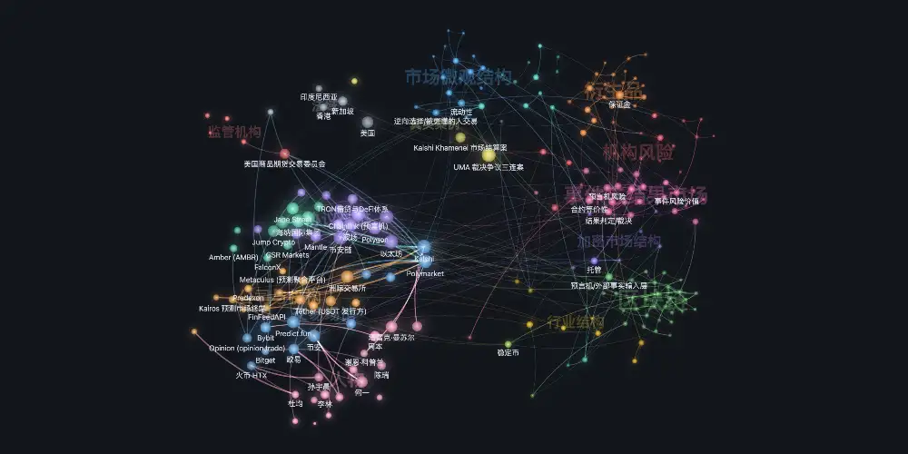

<h1 align="center">CryptoAtlas</h1>

  <b>加密市场结构的知识图谱</b>

  <a href="https://ailinsun.github.io/cryptoatlas"><b>🗺 打开图谱</b></a> ·
  <a href="CONTRIBUTING.md">➕ 补充或纠错</a>

  
  
  
  

  

---

每条断言都标着自己的证据等级。标了 `verified` 却没有来源笔记，build 不过；断言一条关系却拿不出证据，build 不过。纠错是往时间线里追加一条，不是把旧的改掉。

|  | 数量 |
|---|---:|
| 概念 —— 订单簿、清算、衍生品、托管、预言机、裁决、机构风险 | **143** |
| 实体 —— 场馆、做市商、基金、协议、监管、法域、人物 | **76** |
| 它们之间的 typed 关系 | **75** |
| 实证案例（真实争议，带金额与结局） | 3 |
| 来源笔记 | 21 |
| 总笔记 / 总链接 | 292 / 2,813 |

每个概念都写到完整深度：定义、机制、带数字的例子、常见误解、自测题。成熟度公开可见 —— 216 reviewed · 46 verified · 23 seed · 3 stale。

事件与预测市场挖得最深，因为结算问题在那里最难。但它是这张地图里的一条纵向，不是全部。

## 纠错

一家场馆改了费率、一个监管改了口径，笔记就过时了。[提一个纠错 issue](https://github.com/ailinsun/cryptoatlas/issues/new?template=correction.md)，或者直接改 —— `make validate` 会指出这条断言还缺什么。写法见 [CONTRIBUTING.md](CONTRIBUTING.md)。

## 引擎

15 个脚本、42 个测试，把规矩变成 build 的一部分：五档证据分级、`verified` 必须有带 hash 的来源、保密等级不得低于自己的来源、公开树由私库经可审计的脚本派生。

把 `VAULT_PATH` 指向你自己的 vault，同一套纪律就作用在你的领域。

## 许可

代码 [Apache-2.0](LICENSE)，内容 [CC BY 4.0](LICENSE-CONTENT)。

 

---

## English

**A knowledge graph of crypto market structure.**
[Open the atlas](https://ailinsun.github.io/cryptoatlas) · [Add or correct an entry](CONTRIBUTING.md)

Every claim carries its own evidence tier. Marked `verified` with no source note behind
it, the build fails. A relationship asserted without evidence, the build fails. A
correction appends to the timeline; it never rewrites what was there.

|  | count |
|---|---:|
| concepts — order books, clearing, derivatives, custody, oracles, resolution, institutional risk | **143** |
| entities — venues, market makers, funds, protocols, regulators, jurisdictions, people | **76** |
| typed relationships between them | **75** |
| worked case studies (real disputes, with the money and the outcome) | 3 |
| source notes | 21 |
| total notes / links | 292 / 2,813 |

Each concept is written out in full: definition, mechanism, a worked numeric example,
the common misconceptions, self-test questions. Maturity is visible — 216 reviewed ·
46 verified · 23 seed · 3 stale.

Event and prediction markets go deepest, because settlement is hardest there. They are
one thread through the map, not the whole of it.

### Corrections

A venue changes its fees, a regulator shifts position, and a note goes stale.
[Open a correction issue](https://github.com/ailinsun/cryptoatlas/issues/new?template=correction.md),
or fix it yourself — `make validate` names what a claim is still missing. Writing
conventions are in [CONTRIBUTING.md](CONTRIBUTING.md).

### The engine

15 scripts and 42 tests make the rules part of the build: five evidence tiers,
`verified` requires a hashed source, confidentiality is a ceiling a note can never sit
below, and the public tree is derived from a private one by a reviewable script.

Point `VAULT_PATH` at your own vault and the same discipline applies to your domain.

### License

Code [Apache-2.0](LICENSE), content [CC BY 4.0](LICENSE-CONTENT).
