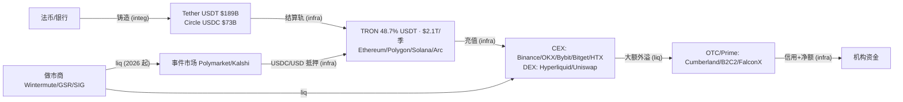

> **边类型图例** (受控词表 [[relationship-types]]): `own` 所有权 · `emp` 雇佣史 · `inv` 投资 · `part` 合作 · `integ` 集成 · `liq` 流动性 · `infra` 基础设施依赖 · `comp` 竞争 · `reg` 监管 · `inf` 推断 (标注) · `?` unknown。**无标签的线不允许存在。**

# 加密资本流: Stablecoin → Chain → Exchange → MM → OTC

关键实测数字 (2026-08 核验): USDT $189B (TRON 占 48.67%) · USDC $73.3B · 事件市场月成交 $44.8B。冻结权/挤兑风险沿 T→CH→EX 每一跳都在: 见 [[stablecoin]] / [[settlement-rail]] / [[custody]]。

