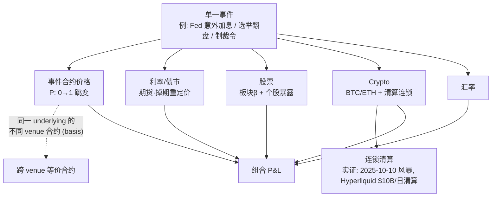

> **边类型图例** (受控词表 [[relationship-types]]): `own` 所有权 · `emp` 雇佣史 · `inv` 投资 · `part` 合作 · `integ` 集成 · `liq` 流动性 · `infra` 基础设施依赖 · `comp` 竞争 · `reg` 监管 · `inf` 推断 (标注) · `?` unknown。**无标签的线不允许存在。**

# 事件风险 → 跨资产组合传导

组合级问题 (机构对话速查 §8): 「看对方向以后, 还有什么让我拿不到钱?」— 答案沿三轴: [[basis-risk]] (等价性) · [[liquidity-risk]] (退出深度) · [[settlement-risk]] (裁决与支付)。

**Event VaR 的构造** ([[event-var]]): 把同一 [[canonical-event-id]] 下的全部头寸 (事件合约 + 相关资产) 映射到共同情景; 条件市场价差 P(B|A)−P(B) 是市场自己报出的传导系数 ([[combinatorial-market]])。2025-10-10 清算风暴与 2026 世界杯脉冲是现成的校准样本。
