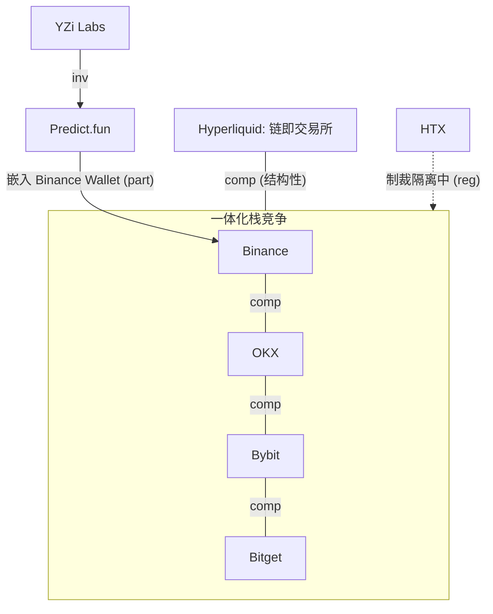

> **边类型图例** (受控词表 [[relationship-types]]): `own` 所有权 · `emp` 雇佣史 · `inv` 投资 · `part` 合作 · `integ` 集成 · `liq` 流动性 · `infra` 基础设施依赖 · `comp` 竞争 · `reg` 监管 · `inf` 推断 (标注) · `?` unknown。**无标签的线不允许存在。**

# 交易所生态权力图 + 六所对比

| | Binance | OKX | HTX | Bybit | Bitget | Hyperliquid |
|---|---|---|---|---|---|---|
| 用户 (公司口径) | ~300M | >60M | >55M | >70M | >125M | ~274k 月活交易者 |
| 治理/CEO | Teng+Yi He co-CEO | Star Xu | 无公开 CEO (Sun 顾问, own disputed) | Ben Zhou | Gracy Chen | Jeff Yan (链) |
| 链 | BNB Chain (own) | X Layer (own) | 绑 TRON (part) | 绑 Mantle (inv/史) | 绑 Morph (BGB 移交) | 自己是链 (own) |
| 平台币 | BNB | OKB (21M 硬顶) | HTX (DAO) | 无 | BGB (→Morph gas) | HYPE |
| 钱包 | Binance Wallet+Trust | OKX Wallet 130 链 | — | Byreal (Solana DEX) | Bitget Wallet 90M | 原生 |
| 美国 | 退出 (和解) | 2025-04 回归 | 无 | 无 | 无 | 无牌照 (政策接触中) |
| 大事 2025-26 | CZ 赦免·MGX $2B·ADGM | DOJ $504M·ICE $25B(单源) | UK/EU 制裁 | $1.5B 被盗(DPRK)·MiCA | BGB→Morph·MiCA 申请中 | HIP-3/4·USDH·JELLY |
| 预测市场 | 无自营 (Wallet 嵌 Predict.fun, part) | 计划中 (单源) | 无 | 无 | 无 | **HIP-4 已上线 (own)** |

纵向一体化机制见 [[exchange-vertical-integration]]; 谱系见 [[chinese-exchange-lineage]]。
