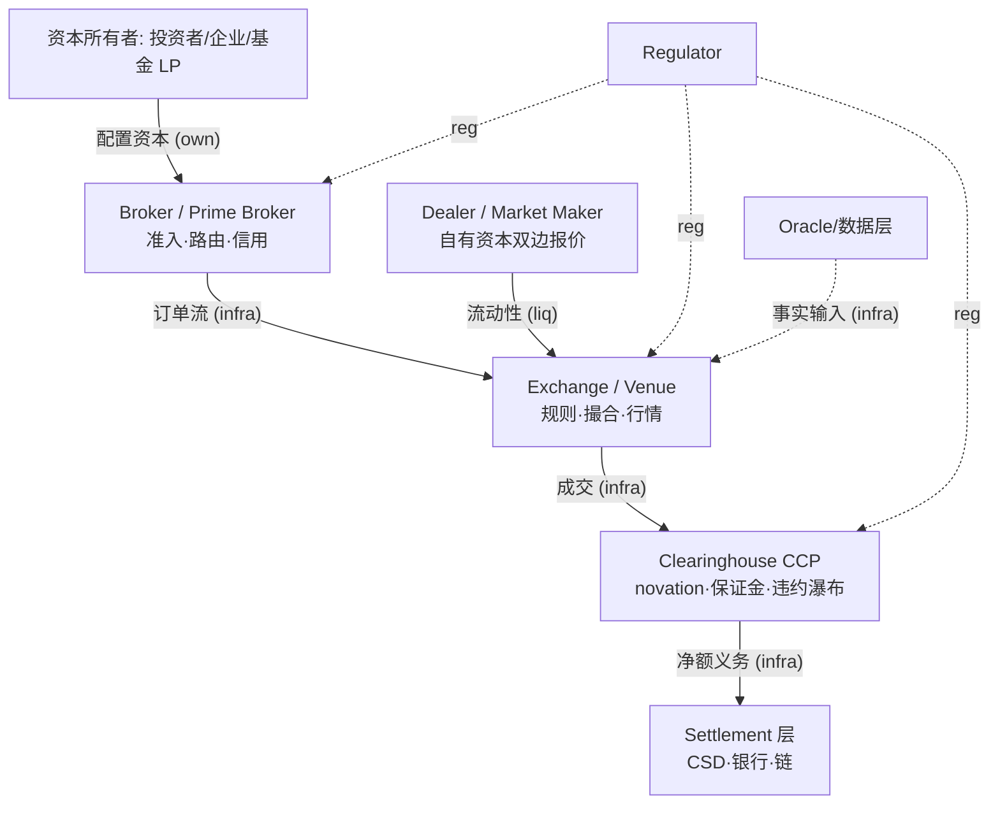

> **边类型图例** (受控词表 [[relationship-types]]): `own` 所有权 · `emp` 雇佣史 · `inv` 投资 · `part` 合作 · `integ` 集成 · `liq` 流动性 · `infra` 基础设施依赖 · `comp` 竞争 · `reg` 监管 · `inf` 推断 (标注) · `?` unknown。**无标签的线不允许存在。**

# 金融市场栈 (谁在哪一层, 钱怎么沉淀)

每层的钱与最怕: 见 [[ecosystem-roles-map]] (workbook 原文 13 角色表)。概念链: [[financial-markets]] → [[exchange]] → [[clearinghouse]] → [[settlement]]。

