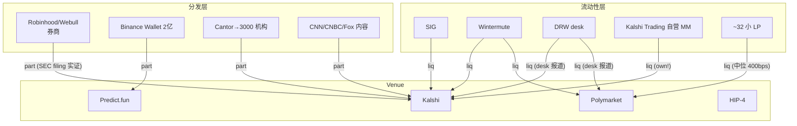

> **边类型图例** (受控词表 [[relationship-types]]): `own` 所有权 · `emp` 雇佣史 · `inv` 投资 · `part` 合作 · `integ` 集成 · `liq` 流动性 · `infra` 基础设施依赖 · `comp` 竞争 · `reg` 监管 · `inf` 推断 (标注) · `?` unknown。**无标签的线不允许存在。**

# 预测市场: 谁拥有用户, 谁供流动性 (2026-08)

**结构判断**: 分发被传统入口 (券商/钱包/投行/媒体) 快速接管, 流动性专业化刚开始 (Polymarket 中位报价仍 400bps) — 需求主流化 × 流动性早期 = MM 工具需求的窗口期 (Wintermute 自己的原话)。**venue 自营 MM (Kalshi Trading) 的利益冲突**已被集体诉讼点名 — market-integrity 情报的现成议题。
