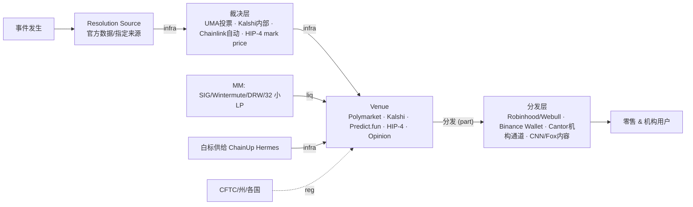

> **边类型图例** (受控词表 [[relationship-types]]): `own` 所有权 · `emp` 雇佣史 · `inv` 投资 · `part` 合作 · `integ` 集成 · `liq` 流动性 · `infra` 基础设施依赖 · `comp` 竞争 · `reg` 监管 · `inf` 推断 (标注) · `?` unknown。**无标签的线不允许存在。**

# 预测市场价值链 (2026-08 实测版)

链上每环的抽水与风险: venue 抽 taker 费 (Polymarket 2026 费率表 / Kalshi 费) · 裁决层出 [[resolution-risk]] (三连争议+Khamenei) · 分发层拿用户 (Robinhood 依赖 Kalshi = SEC filing 实证)。

