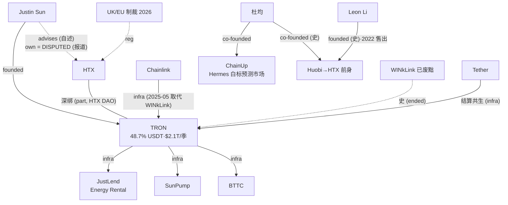

> **边类型图例** (受控词表 [[relationship-types]]): `own` 所有权 · `emp` 雇佣史 · `inv` 投资 · `part` 合作 · `integ` 集成 · `liq` 流动性 · `infra` 基础设施依赖 · `comp` 竞争 · `reg` 监管 · `inf` 推断 (标注) · `?` unknown。**无标签的线不允许存在。**

# TRON / HTX / ChainUp 生态 (含 disputed 标注)

三个要点: ① TRON 是 USDT 主轨但制裁暴露经 HTX 传导 (Binance 已切割 UK/EU HTX 交易); ② WINkLink 被自家生态废黜 = oracle 层无忠诚; ③ ChainUp 与 HTX 无直接股权证据 — 连接只在杜均的人脉层 (`emp/inv` 级, 非 `own`)。
